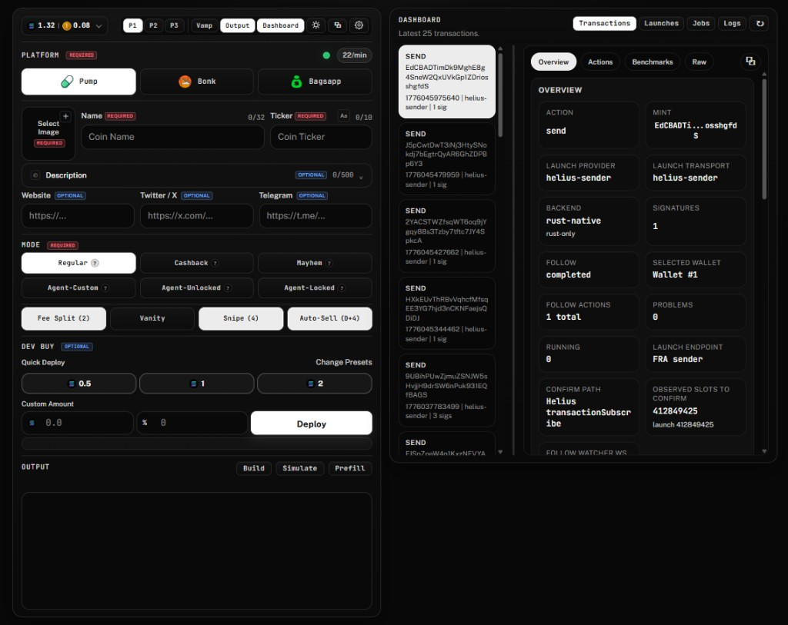

# LaunchDeck by Trench.tools

LaunchDeck is a self-hosted Solana launch and snipe tool built under the broader `Trench.tools` project.

[](https://trench.tools/)
[](https://x.com/TrenchDotTools)
[](https://x.com/0xd3bt)
[](https://x.com/i/communities/2038790841418838419)

> ### Contract Address
> `L73w5odyo5ZdJ1fPp319nfjqaFfHDdKifRmM8Kxpump`

LaunchDeck lets you run launches locally, use your own wallets and provider keys, and control how creation, buy, sell, and follow actions are built and sent.

This repo is under active development. The README reflects the setup and features we consider usable today.

LaunchDeck is open-source tooling provided as-is. Running it, configuring it, modifying it, deploying it, or using it in any way is entirely the user's own responsibility. By using this software, you accept full responsibility for your environment, infrastructure, wallets, keys, dependencies, third-party packages, and any outcomes that result from its use.



## Start Here

Choose the path that matches how you plan to run LaunchDeck:

- local Windows machine: go to `Quick Start` and expand `Windows Local Setup`
- local Linux machine: go to `Quick Start` and expand `Linux Local Setup`
- fresh VPS: use `docs/VPS_SETUP.md`

Practical recommendation:

- even for testing, a VPS is the recommended path because it is cheap, usually more secure, and gives you the latency profile you actually care about
- local machine setup is still supported when you intentionally want to experiment or edit from your own workstation
- if you want a straightforward VPS provider, [Vultr](https://www.vultr.com/?ref=9589308) is the worked example used in `docs/VPS_SETUP.md`
- Vultr is recommended here because it is easy to deploy quickly across a very wide range of regions, supports normal card/fiat-style payments as well as crypto, and has been reliable in long-term use
- if you use Vultr, please use [my referral link](https://www.vultr.com/?ref=9589308)
- any other VPS provider is also completely fine as long as you place it close to the provider endpoints and RPCs you actually plan to use

Personal note:

- I have used Vultr for 5+ years and have not had issues with it

AI setup help:

- if you use Cursor or Codex, you can have it help walk you through the setup steps, install commands, `.env` editing, and VPS bootstrapping

## Recommended Stack

For most operators today, the best-supported testing and production setup is:

- run LaunchDeck on a VPS rather than on your everyday local workstation
- place the VPS close to the provider endpoints and RPCs you actually plan to use
- EU VPS location: Frankfurt or Amsterdam
- US VPS location: New York / Newark area or Salt Lake City area
- Asia VPS location: Singapore or Tokyo
- [Helius dev tier](https://www.helius.dev/pricing) for your main infrastructure
- `Helius Gatekeeper HTTP` for `SOLANA_RPC_URL`
- `Helius standard websocket` for `SOLANA_WS_URL`
- a separate [Shyft](https://shyft.to/) free-tier RPC for `LAUNCHDECK_WARM_RPC_URL`
- `Helius Sender` or `Hello Moon` as the execution provider

Practical routing note:

- for EU, the default `eu` routing profile is already centered on Amsterdam + Frankfurt
- for US, the practical target is New York / Newark area or Salt Lake City area; if you want to stay pinned to a Helius metro, use `ewr` or `slc`
- for Asia, keep the VPS close to the Asian endpoints you actually plan to use, which usually means Singapore or Tokyo
- if you are provisioning a fresh VPS, start with `docs/VPS_SETUP.md`

Why this is the default recommendation:

- a nearby VPS usually matters more than workstation convenience once you care about live execution quality
- Helius Gatekeeper HTTP benchmarked best for the main HTTP RPC path
- Helius standard websocket benchmarked best for the watcher websocket path
- [Helius dev tier](https://www.helius.dev/pricing) gives a noticeable improvement in watcher quality and execution consistency, especially when you run multiple snipes or watcher-heavy follow automation
- Shyft is a good fit for `LAUNCHDECK_WARM_RPC_URL` because its free tier offers unlimited calls at `10 RPS`, and it is well-suited to warm/cache/block-height traffic

### Benchmarked baseline

This is the current baseline we are recommending from our own testing on a Frankfurt VPS:

- Shyft free tier
- Helius Developer tier, about `$50/month`, via [Helius pricing](https://www.helius.dev/pricing)
- 80 timed samples per metric
- warmup cycles enabled
- 100 ms request gap, about `10 RPS` per endpoint

Shareable summary:

| Provider | HTTP cold avg | HTTP warm avg | WS handshake | WS slotSubscribe avg | WS accountSubscribe avg | WS transactionSubscribe avg |
| --- | --- | --- | --- | --- | --- | --- |
| Shyft free tier | 18.97 ms | 18.15 ms | 18.46 ms | 4.77 ms | 5.55 ms | — |
| Helius standard | 49.24 ms | 29.29 ms | 62.33 ms | 3.74 ms | 3.23 ms | 3.58 ms |
| Helius Gatekeeper | 6.45 ms | 2.36 ms | 9.88 ms | 43.27 ms | 43.51 ms | 43.56 ms |

Out of the Helius and Shyft options tested here:

- Helius Gatekeeper benchmarked best for the HTTP RPC path
- Helius standard websocket benchmarked best for websocket watcher subscriptions
- Shyft free tier was still strong enough to be a very good warm RPC choice

That is why the recommended split in LaunchDeck is:

- Helius Gatekeeper for `SOLANA_RPC_URL`
- Helius standard websocket for `SOLANA_WS_URL`
- Shyft free tier for `LAUNCHDECK_WARM_RPC_URL`

Do not treat these numbers as universal.

- benchmark your own connections, especially warm results, from the exact VPS and region you actually run
- dedicated nodes or more specialized infra will likely beat this
- for what LaunchDeck is currently meant to do, this baseline is already good enough to launch and compete for `0` block in hundreds of milliseconds

If you want to reproduce or compare your own setup, use:

- `docs/BENCHMARKING.md`
- `Benchmarking/README.md`

Hello Moon note:

- `hellomoon` is a recommended alternate low-latency execution path
- it requires a Lunar Lander API key from Hello Moon
- request access through the [Lunar Lander docs](https://docs.hellomoon.io/reference/lunar-lander) or the [Hello Moon Discord](https://discord.com/invite/HelloMoon)

## Easiest First Setup

If you intentionally want to run LaunchDeck on your own machine, the local setup path is:

1. choose one local setup section below: `Windows` or `Linux`
2. install the prerequisites for your platform and run `npm install`
3. copy `.env.example` to `.env`
4. fill only the values already listed in `.env.example`
5. start LaunchDeck with `npm start`
6. leave the advanced defaults alone until you actually need them

The starter template is meant to be enough for a normal first setup. If you want every variable, use `.env.advanced` and `docs/ENV_REFERENCE.md`.

Choose the setup path that matches how you actually run LaunchDeck:

- local workstation or existing machine: follow the quick-start steps in this README
- fresh VPS instance: use `docs/VPS_SETUP.md` first; this is still the recommended path even for testing because it is cheap, private by default, and closer to the latency profile you actually want

For the exact starter `.env` values, use the `Recommended .env values` section in `Quick Start` below.

## What Is Already Enabled By Default

You do not need to manually enable most of the runtime behavior we recommend.

These already default on or to sensible production values:

- startup warm
- continuous warm
- idle warm suspend
- Helius `transactionSubscribe` probe/fallback behavior when your websocket is Helius
- Bonk and Bags helper workers
- benchmark mode `full`
- Helius auto-fee priority level `high`
- Jito auto-fee percentile `p99`
- main host port `8789`
- follow daemon port `8790`

In most setups, the best move is to leave those defaults alone and start with the values in `.env.example`.

## How The Runtime Works

LaunchDeck runs as two local Rust processes:

- the main host on `http://127.0.0.1:8789` by default
- the follow daemon on `http://127.0.0.1:8790` by default

The main host serves:

- the browser UI
- browser-facing `/api/*` routes
- engine execution routes
- uploaded assets

The follow daemon handles:

- delayed buys and sells
- realtime slot, signature, and market watchers
- follow timing and watcher health
- persisted follow-job state outside the main request lifecycle

### Warmup and keep-alive

LaunchDeck separates three ideas:

- execution transport
- read/confirm RPC
- watcher websocket

In practice:

- `Helius Sender` or `Hello Moon` handle the low-latency send path
- `SOLANA_RPC_URL` handles reads, confirmations, and general runtime RPC behavior
- `SOLANA_WS_URL` handles realtime watchers
- `LAUNCHDECK_WARM_RPC_URL` handles startup warm, continuous warm probes, and block-height observation so that traffic does not have to hit your main execution RPC

Current warm behavior:

- startup warm runs once when the app starts
- continuous warm keeps the active routes hot while the app is in use
- idle warm suspend pauses that background warm traffic when the app is idle
- watcher websocket warm probes the configured watcher path; it is not a separate provider-region fanout path

When you save settings:

- if the effective send routes changed, LaunchDeck immediately rewarms the new paths
- if the effective routes did not change, LaunchDeck keeps the current warm schedule instead of needlessly restarting it

### Region and metro routing

`USER_REGION` is the shared default profile for region-aware providers.

Supported group values:

- `global`
- `us`
- `eu`
- `asia`

Supported metro tokens:

- `slc`
- `ewr`
- `lon`
- `fra`
- `ams`
- `sg`
- `tyo`

Important behavior:

- Helius Sender supports exact metro routing where those metros exist
- Hello Moon maps unsupported metros onto the closest Hello Moon endpoints it actually exposes
- `eu` fans out across Amsterdam + Frankfurt
- `asia` fans out across Singapore + Tokyo on Helius Sender, while Hello Moon `asia` / `sg` fall back to Tokyo
- `us` fans out across Salt Lake City + Newark on Helius Sender, while Hello Moon `us` / `slc` / `ewr` fan out across New York + Ashburn

## Quick Start

### 1. Choose Your Local Platform

LaunchDeck uses:

- Rust for the engine and follow daemon
- Node.js for runtime helpers and launchpad helper scripts

If you are running LaunchDeck on your own machine, expand one section below and follow only that section.

If you are starting from a blank VPS instead, use `docs/VPS_SETUP.md` rather than the local-machine steps here.

<details>
<summary>Windows Local Setup</summary>

Use PowerShell for the local setup flow.

Install first:

- [`Git`](https://git-scm.com/downloads)
- [`Node.js 20`](https://nodejs.org/en/download)
- Rust stable with the normal Windows MSVC toolchain from [`rustup`](https://rustup.rs/)
- [`Visual Studio Build Tools`](https://visualstudio.microsoft.com/downloads/) with the C++ toolchain if your Rust build complains about missing linker or compiler tools

Recommended flow from the repo root:

```powershell
npm install
Copy-Item .env.example .env
```

Practical notes:

- after installing Rust for the first time, reopen PowerShell before running `npm install`
- `npm start`, `npm stop`, and `npm restart` use the repo's PowerShell runtime scripts on Windows
- if startup fails, check `.local\launchdeck\engine-error.log` and `.local\launchdeck\follow-daemon-error.log`

</details>

<details>
<summary>Linux Local Setup</summary>

These commands assume a Debian or Ubuntu style machine. On other distros, install the equivalent packages first.

Install first:

- [`Git`](https://git-scm.com/downloads)
- [`Node.js 20`](https://nodejs.org/en/download)
- Rust stable via [`rustup`](https://rustup.rs/)
- build tools such as [`build-essential`](https://packages.ubuntu.com/search?keywords=build-essential), [`pkg-config`](https://packages.ubuntu.com/search?keywords=pkg-config), and [`libssl-dev`](https://packages.ubuntu.com/search?keywords=libssl-dev)

Example flow:

```bash
sudo apt-get update
sudo apt-get install -y git curl build-essential pkg-config libssl-dev
curl https://sh.rustup.rs -sSf | sh -s -- -y
source "$HOME/.cargo/env"
npm install
cp .env.example .env
```

Practical notes:

- if you install Node.js through your package manager, make sure you end up on `Node.js 20`
- after a first-time Rust install, either `source "$HOME/.cargo/env"` or open a new shell before running LaunchDeck commands
- if startup fails, check `.local/launchdeck/engine-error.log` and `.local/launchdeck/follow-daemon-error.log`

</details>

Manual/local install baseline:

- Node.js `20`
- Rust stable via `rustup`
- Git
- build tools such as `build-essential`, `pkg-config`, and `libssl-dev` on Ubuntu

If you are starting from a blank VPS, do not hand-roll that first pass unless you want to. `docs/VPS_SETUP.md` walks through the current bootstrap path and the `scripts/vps-bootstrap.sh` installer handles the common system packages plus Rust, Node.js, repo clone, `npm install`, and the `systemd` service setup.

From the repo root, once your dependencies are installed:

```bash
npm install
```

### 2. Configure `.env`

Copy `.env.example` to `.env`, then fill the starter values.

If you used one of the platform sections above, you may already have created `.env`. In that case, just edit it now.

If you want the full list, use:

- `.env.advanced`
- `docs/ENV_REFERENCE.md`

### 3. Start the runtime

Primary commands:

- `npm start`
- `npm stop`
- `npm restart`

`npm start` launches both the main host and the follow daemon together, waits for health, and opens the UI when supported.

First-run note:

- the first startup can take several minutes because Rust may still need to build the binaries

What success looks like:

- the main host becomes available at `http://127.0.0.1:8789`
- the follow daemon becomes available at `http://127.0.0.1:8790`
- the UI opens automatically when your platform supports that behavior

If startup fails, check these logs first:

- Windows: `.local\launchdeck\engine-error.log` and `.local\launchdeck\follow-daemon-error.log`
- Linux: `.local/launchdeck/engine-error.log` and `.local/launchdeck/follow-daemon-error.log`

### 4. Open the UI

Default local URL:

- `http://127.0.0.1:8789`

Basic run flow:

- confirm your wallets are loaded from `SOLANA_PRIVATE_KEY*`
- set your normal preset defaults in the Settings modal
- you are ready to launch

### First Live Run Checklist

For the first live launch, keep it simple:

1. load one wallet
2. set `SOLANA_RPC_URL`, `SOLANA_WS_URL`, `USER_REGION`, and `LAUNCHDECK_WARM_RPC_URL`
3. leave the provider on `Helius Sender`
4. run `Build`
5. run `Simulate`
6. only then run `Deploy`

### Recommended `.env` values

If you do not want to fetch the exact Helius URLs from the dashboard yourself, you can copy these exactly and replace only the API key:

```bash
SOLANA_RPC_URL=https://beta.helius-rpc.com/?api-key=YOUR_HELIUS_API_KEY
SOLANA_WS_URL=wss://mainnet.helius-rpc.com/?api-key=YOUR_HELIUS_API_KEY
LAUNCHDECK_WARM_RPC_URL=https://rpc.fra.shyft.to?api_key=YOUR_SHYFT_API_KEY
```

Put your Helius key immediately after `api-key=`. Put your Shyft key immediately after `api_key=`.

At minimum, most operators should set:

- `SOLANA_PRIVATE_KEY` or the `SOLANA_PRIVATE_KEY*` wallet slots they want to use
- `SOLANA_RPC_URL`
- `SOLANA_WS_URL`
- `USER_REGION`
- `LAUNCHDECK_WARM_RPC_URL`

Optional but common:

- `HELLOMOON_API_KEY`
- `BAGS_API_KEY`
- `LAUNCHDECK_METADATA_UPLOAD_PROVIDER=pinata`
- `PINATA_JWT`
- `LAUNCHDECK_BENCHMARK_MODE`

## Security Note

Keep the runtime private by default:

- do not expose the raw LaunchDeck UI publicly unless you intentionally add your own access controls
- do not share your `.env`
- keep private keys only on the machine or VPS that is actually running LaunchDeck
- for production, prefer the SSH-tunnel VPS pattern documented in `docs/VPS_SETUP.md`

## Provider Summary

Current provider choices:

- `Helius Sender`
- `Hello Moon`
- `Standard RPC`
- `Jito Bundle`

Current recommendation:

- start with `Helius Sender` if you want the easiest production default
- use `Hello Moon` when you want a strong alternate low-latency execution path
- use `Standard RPC` when you want explicit plain-RPC transport behavior
- use `Jito Bundle` when you explicitly want bundle semantics

## Follow Automation

LaunchDeck supports:

- same-time sniper buys
- delayed sniper buys
- confirmed-block sniper buys
- automatic dev sell
- snipe sells

This is handled by the dedicated follow daemon so the main launch request does not have to stay open for delayed actions.

## Current Support

High-level support today:

- Pump: verified primary path
- Bonk: verified helper-backed path
- Bagsapp: supported when Bags credentials are configured

See `docs/LAUNCHPADS.md` for the detailed launchpad and mode matrix.

## Documentation Map

Start here:

- `README.md`
  First setup path and docs map
- `docs/CONFIG.md`
  Recommended setup, runtime behavior, warm/watch explanation, and operator-facing config guidance
- `docs/ENV_REFERENCE.md`
  Full environment variable reference, defaults, and override behavior

Execution and routing:

- `docs/PROVIDERS.md`
  Provider behavior, endpoint profiles, endpoint catalogs, and routing rules
- `docs/EXECUTION_DOS_AND_DONTS.md`
  Lower-level execution transport reference and implementation rules

Operator guides:

- `docs/USAGE.md`
  Normal UI workflow from startup through deploy and reuse
- `docs/FOLLOW_DAEMON.md`
  Follow daemon, triggers, watcher behavior, and follow timing
- `docs/VPS_SETUP.md`
  VPS deployment and SSH-tunnel workflow

Reporting, troubleshooting, and benchmarking:

- `docs/TROUBLESHOOTING.md`
  Common operator problems and what to check
- `docs/REPORTING.md`
  Reports, history, and local state
- `docs/BENCHMARKING.md`
  Benchmarking concepts and how to interpret results
- `Benchmarking/README.md`
  Copy-paste benchmark commands

Additional reference:

- `docs/LAUNCHPADS.md`
- `docs/STRATEGIES.md`
- `docs/ARCHITECTURE.md`
